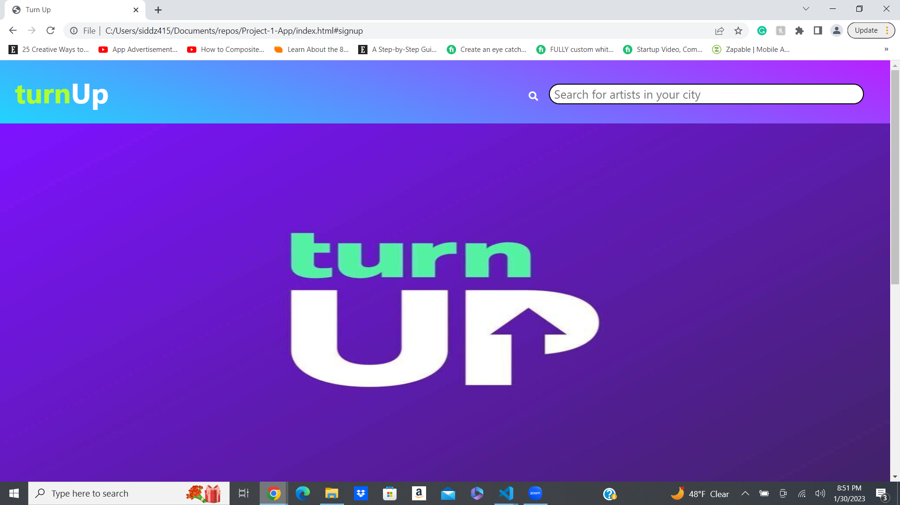

# Turn Up-App
# Name of Project

## Table of Contents

- [Overview](#overview)
- [Built With](#built-with)
- [Features](#features)
- [Contact](#contact)
- [Acknowledgements](#acknowledgements)

## Overview

<!-- TODO: Add a screenshot of the live project.
    1. Link to a 'live demo.'
    2. Describe your overall experience in a couple of sentences.
    3. List a few specific technical things that you learned or improved on.
    4. Share any other tips or guidance for others attempting this or something similar.
 --> We decided to make an event app name Turn UP. We use two API (Spotify Api and Concert event tracker Api). When you search for an artist, it will show up biography and upcoming event of the performer. You can enter your zip code and it will show all the available shows of your artist in your region. You can save the event by clicking on save event button which will display all the saved events

### Built With
    HTML, CSS, JAVASCRIPT.
<!-- TODO: List any MAJOR libraries/frameworks (e.g. React, Tailwind) with links to their homepages. -->

## Features

<!-- TODO: List what specific 'user problems' that this application solves. -->This app makes it easy for users to search and plan for concerts of their favorite artists. It also provides services for users to look up and save live entertainment events.

## Contact
 
<!-- TODO: Include icons and links to your RELEVANT, PROFESSIONAL 'DEV-ORIENTED' social media. LinkedIn and dev.to are minimum. -->

## Acknowledgements
https://cdnjs.cloudflare.com/ajax/libs/materialize/1.0.0/css/materialize.min.css
<!-- TODO: List any blog posts, tutorials or plugins that you may have used to complete the project. Only list those that had a significant impact. Obviously, we all 'Google' stuff while working on our things, but maybe something in particular stood out as a 'major contributor' to your skill set for this project. -->